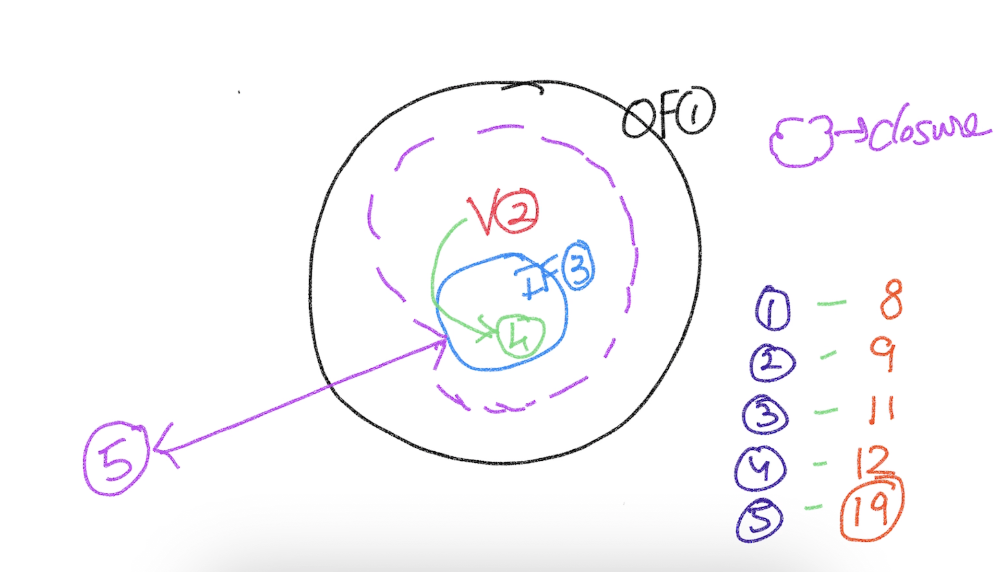

# Closures #

## Steps ##
1. An outer function
2. A variable in the outer function
3. An inner function
4. The variable in the outer function is referred in the inner function
5. Extend the lifetime of the inner function beyond the lifetime of the outer function



## Assignment ##
Create an object (spinner)
```
    var spinner = /*....*/
```
The object must have the following behaviors
- up()
- down()

Their behaviors should be as follows:
```
    spinner.up() //=> 1
    spinner.up() //=> 2
    spinner.up() //=> 3
    spinner.up() //=> 4

    spinner.down() //=> 3
    spinner.down() //=> 2
    spinner.down() //=> 1
    spinner.down() //=> 0
    spinner.down() //=> -1
```
Important:
- No HTML page (no button, no click)... ONLY JavaScript
- The behavior (outcome) of the "up & down" methods SHOULD NOT be influencible from outside